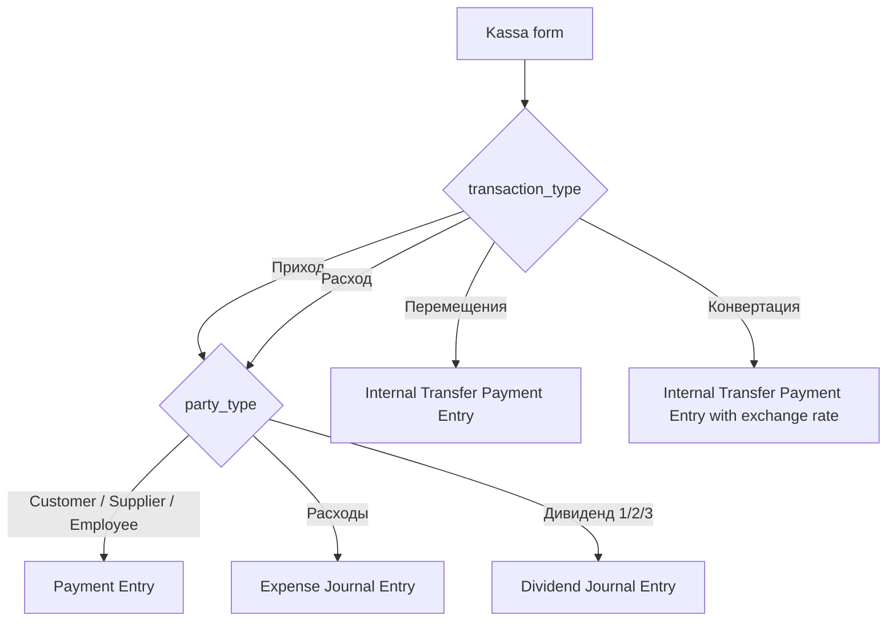
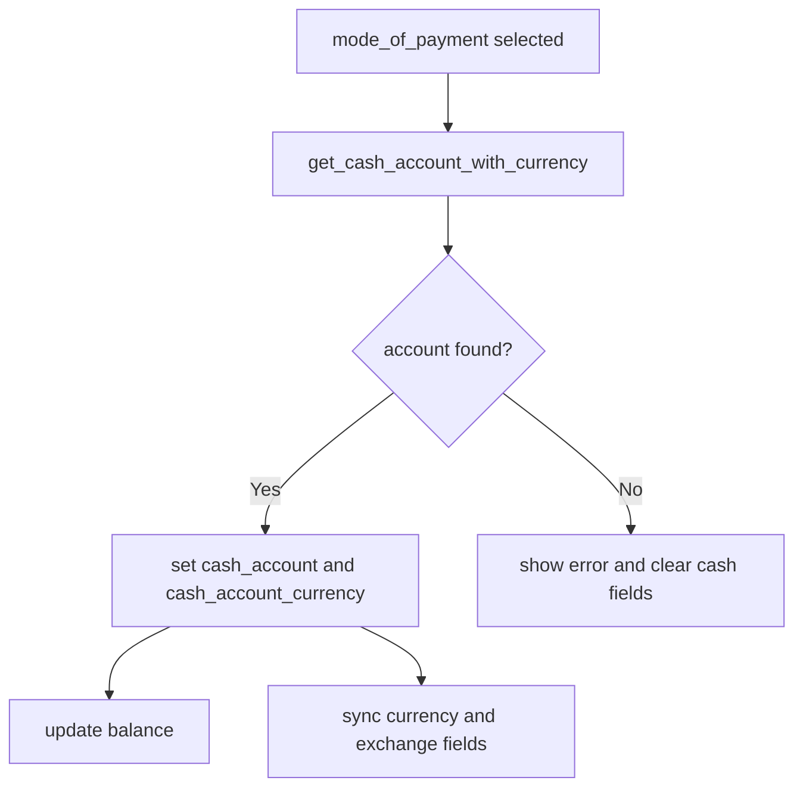
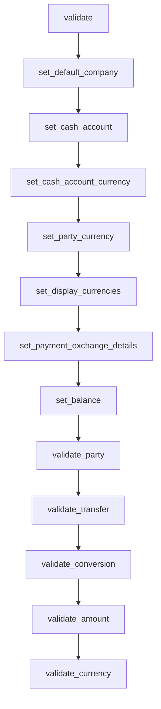
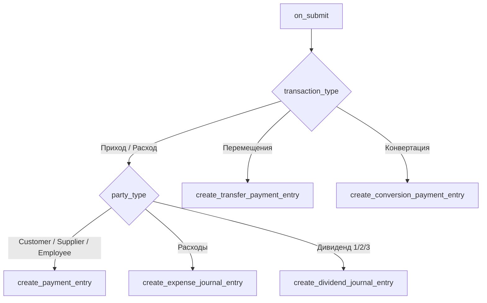
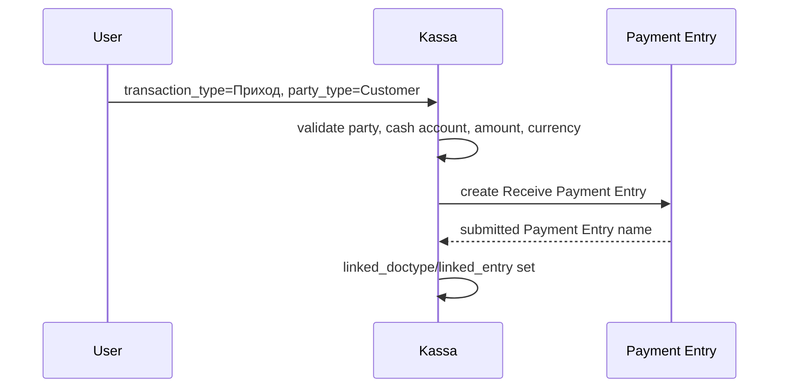
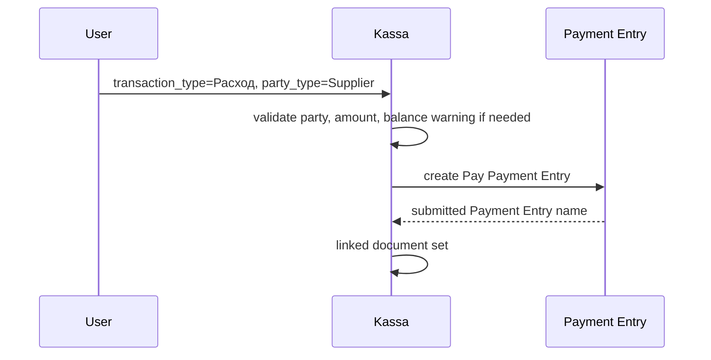
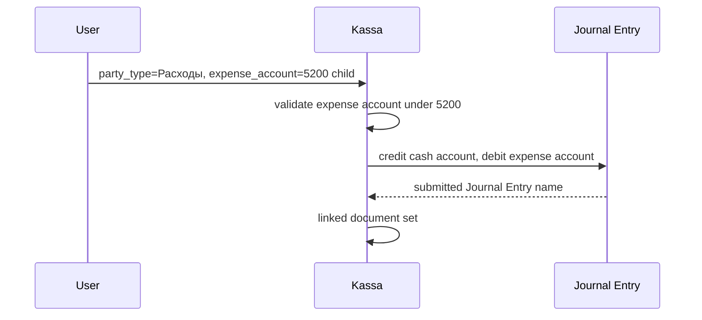
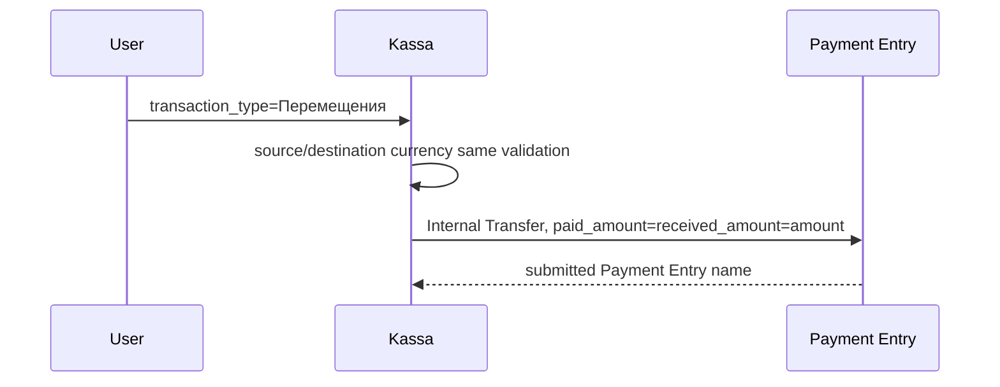
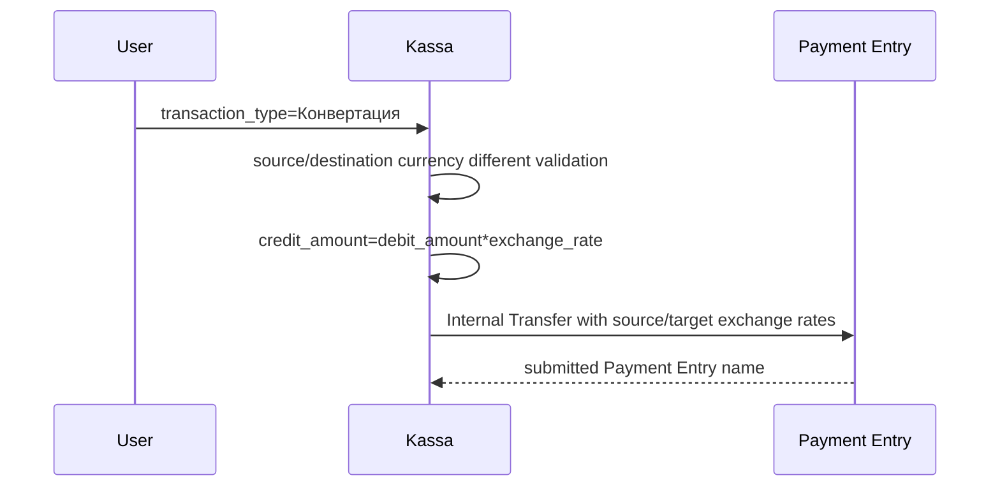

# Kassa DocType Logic

Bu hujjat Pokiza app ichidagi `Kassa` DocType ishlash mantiqini tushuntiradi.
Maqsad: formdagi har bir asosiy field, frontend event, backend validation, submit/cancel oqimi va accounting document yaratish qoidalarini bitta joyda ko'rish.

Manba fayllar:

- `pokiza/pokiza_for_business/doctype/kassa/kassa.json` - DocType fieldlari, ko'rinish shartlari, permissionlar.
- `pokiza/pokiza_for_business/doctype/kassa/kassa.js` - formdagi frontend eventlar, filterlar, balans/kurs UI logikasi.
- `pokiza/pokiza_for_business/doctype/kassa/kassa.py` - backend validate, submit, cancel, accounting document yaratish.
- `pokiza/pokiza_for_business/doctype/kassa/test_kassa.py` - asosiy routing va validation testlari.

## 1. Kassa Nima Uchun Ishlatiladi

`Kassa` pul harakatlarini kiritish uchun ishlatiladi. U 4 ta asosiy operatsiyani qo'llaydi:

| Operatsiya | Ma'nosi | Submit bo'lganda |
| --- | --- | --- |
| `Приход` | Kirim | Odatda `Payment Entry` yaratiladi |
| `Расход` | Chiqim | Party turiga qarab `Payment Entry` yoki `Journal Entry` yaratiladi |
| `Перемещения` | Bir kassadan boshqa kassaga o'tkazish | `Payment Entry` - `Internal Transfer` |
| `Конвертация` | Valyuta almashtirish | `Payment Entry` - `Internal Transfer`, kurs bilan |

High-level xarita:



## 2. Asosiy Fieldlar

| Field | Vazifasi | Muhim qoida |
| --- | --- | --- |
| `naming_series` | Kassa raqami series | `KASSA-.YYYY.-` |
| `date` | Sana | Default `Today` |
| `transaction_type` | Operatsiya turi | `Приход`, `Расход`, `Перемещения`, `Конвертация` |
| `mode_of_payment` | Qaysi kassadan yoki payment usulidan pul chiqadi/kiradi | `Mode of Payment Account` orqali `cash_account` topiladi |
| `company` | Company | `Перемещения`da bo'sh bo'lsa default company qo'yiladi |
| `cash_account` | Manba account | Hidden, backend/frontend avtomatik to'ldiradi |
| `cash_account_currency` | Manba account valyutasi | Read only |
| `mode_of_payment_to` | Qayerga o'tkaziladi | Faqat `Перемещения` va `Конвертация`da ko'rinadi |
| `cash_account_to` | Destination account | Hidden, avtomatik |
| `cash_account_to_currency` | Destination valyuta | Hidden/read only |
| `balance` | Manba balans | `GL Entry`dan account currency bo'yicha hisoblanadi |
| `balance_to` | Destination balans | `Перемещения` / `Конвертация` uchun |
| `party_type` | Kontragent turi | `Приход` / `Расход` uchun |
| `party` | Customer/Supplier/Employee va boshqalar | Dynamic Link |
| `party_name` | Kontragent nomi | Frontendda fetch qilinadi |
| `party_currency` | Kontragent valyutasi | Customer/Supplier/Employee uchun |
| `expense_account` | Xarajat account | Faqat `party_type = Расходы`; faqat 5200 ichidagi accountlar |
| `expense_account_name` | Xarajat account nomi | Read only/fetch |
| `amount` | Asosiy summa | `Конвертация`da ishlatilmaydi, uning o'rniga `debit_amount`/`credit_amount` |
| `exchange_rate` | Kurs | Multicurrency party payment yoki conversionda |
| `debit_amount` | Manba summa | Conversionda foydalanuvchi kiritadi; party multicurrencyda amountdan olinadi |
| `credit_amount` | Destination/party valyutasidagi summa | Avtomatik yoki manual |
| `target_amount_currency` | `credit_amount` valyutasi | Hidden, UI uchun |
| `manual_credit_amount` | `credit_amount` qo'lda o'zgartirilganmi | Hidden flag |
| `remarks` | Izoh | Accounting document remark/user_remarkga tushadi |
| `currency_info_html` | UI info panel | Frontend render qiladi |
| `linked_doctype` | Bog'langan document turi | Submitdan keyin qo'yiladi |
| `linked_entry` | Bog'langan document | Submitdan keyin qo'yiladi |

## 3. Frontend Oqimi

### 3.1 Refresh

Form ochilganda `refresh` quyidagilarni qiladi:

1. `expense_account` uchun query o'rnatadi.
2. `mode_of_payment` uchun faqat enabled payment usullarini ko'rsatadi.
3. Agar `mode_of_payment` va `company` bor bo'lsa balansni yangilaydi.
4. Agar `mode_of_payment_to` va `company` bor bo'lsa destination balansni yangilaydi.
5. `mode_of_payment_to` uchun source paymentdan boshqa paymentlarni ko'rsatadi.
6. `Конвертация`da kurs yo'q bo'lsa kursni olib kelishga urinadi.
7. Balans label, currency fieldlar, exchange fieldlar va info panelni refresh qiladi.

### 3.2 Expense Account Filter

`expense_account` oddiy `Account` link emas, custom backend query ishlatadi:

```js
query: "pokiza.pokiza_for_business.doctype.kassa.kassa.get_expense_accounts"
```

Natija:

- `company` bo'yicha filter qiladi.
- Faqat `root_type = Expense`.
- Faqat `is_group = 0`.
- Faqat `5200` parent account ichidagi leaf accountlar.
- Masalan `5203` chiqadi, lekin `5111` chiqmaydi.

### 3.3 Company O'zgarsa

`company` o'zgarganda quyidagilar tozalanadi:

- `mode_of_payment`
- `cash_account`
- `balance`
- `cash_account_to_currency`
- `target_amount_currency`
- `party`
- `expense_account`

So'ng currency/exchange/info UI qayta hisoblanadi.

### 3.4 Mode Of Payment O'zgarsa

`mode_of_payment` tanlanganda:



`Перемещения` yoki `Конвертация` bo'lsa, `mode_of_payment_to`, `cash_account_to`, `balance_to` ham tozalanadi. Sababi source o'zgarsa destination qayta tanlanishi kerak.

### 3.5 Transaction Type O'zgarsa

`transaction_type` o'zgarganda form eski operatsiyadan qolgan qiymatlarni tozalaydi:

- party fieldlar
- expense account
- payment source/destination
- balanslar
- exchange rate
- debit/credit amount

`Перемещения`da company yo'q bo'lsa `Global Defaults.default_company` olinadi.

`Конвертация`da kurs fetch qilishga urinadi.

### 3.6 Mode Of Payment To O'zgarsa

`mode_of_payment_to` tanlanganda:

1. Destination account va currency topiladi.
2. `cash_account_to`, `cash_account_to_currency` to'ldiriladi.
3. `balance_to` yangilanadi.
4. `validate_transfer_pair` frontend warning beradi.
5. `Конвертация` bo'lsa kurs va credit amount qayta hisoblanadi.

### 3.7 Transfer Pair Frontend Warning

`validate_transfer_pair` faqat frontendda ogohlantiradi:

- `Перемещения`: source va destination valyuta bir xil bo'lishi kerak.
- `Конвертация`: source va destination valyuta har xil bo'lishi kerak.

Backend ham alohida validate qiladi, shuning uchun frontend warningni chetlab o'tib bo'lmaydi.

### 3.8 Party Type O'zgarsa

`party_type` o'zgarganda:

| party_type | UI qoida |
| --- | --- |
| `Расходы` | `expense_account` majburiy, `party` majburiy emas |
| `Дивиденд 1/2/3` | `party` ham, `expense_account` ham majburiy emas |
| Customer/Supplier/Employee | `party` majburiy, `expense_account` majburiy emas |
| Bo'sh | Ikkalasi ham majburiy emas |

Shuningdek `party`, `expense_account`, `party_name`, `expense_account_name` tozalanadi.

### 3.9 Party O'zgarsa

`party` tanlanganda:

- Customer bo'lsa `customer_name` olinadi.
- Supplier bo'lsa `supplier_name` olinadi.
- Employee bo'lsa `employee_name` olinadi.
- Shareholder bo'lsa `title` olinadi.
- Customer/Supplier uchun backenddan `party_currency` olinadi.
- Currency/exchange/info UI qayta hisoblanadi.

### 3.10 Amount, Exchange Rate, Credit Amount

Party multicurrency bo'lsa:

- `amount` o'zgarsa `manual_credit_amount = 0` bo'ladi.
- `exchange_rate` o'zgarsa `manual_credit_amount = 0` bo'ladi.
- `credit_amount` foydalanuvchi qo'lda o'zgartirsa `manual_credit_amount = 1` bo'ladi.
- `credit_amount = amount * exchange_rate`, agar manual flag yo'q bo'lsa.

Conversion bo'lsa:

- `debit_amount * exchange_rate = credit_amount`.
- `credit_amount` read only.
- `debit_amount` foydalanuvchi kiritadigan source summa.

## 4. Backend Validate Tartibi

`Kassa.validate()` har save/submit oldidan shu tartibda ishlaydi:



### 4.1 set_default_company

Faqat `transaction_type = Перемещения` va `company` bo'sh bo'lsa ishlaydi.

- `Global Defaults.default_company` bor bo'lsa `company`ga qo'yadi.
- Bo'lmasa error beradi.

### 4.2 set_cash_account

`Mode of Payment Account` child tabledan account oladi:

- `mode_of_payment` -> `cash_account`
- `mode_of_payment_to` -> `cash_account_to`

### 4.3 set_cash_account_currency

Accountlardan `account_currency` olib qo'yadi:

- `cash_account` -> `cash_account_currency`
- `cash_account_to` -> `cash_account_to_currency`

### 4.4 set_party_currency

Customer/Supplier/Employee uchun party valyutasini aniqlaydi.

Customer/Supplier:

1. ERPNext `get_party_account` orqali account topiladi.
2. Account currency olinadi.
3. Topilmasa party default currency olinadi.
4. Topilmasa company default currency olinadi.

Employee:

1. Companydagi `account_type = Payable`, `is_group = 0` account topiladi.
2. Account currency olinadi.
3. Topilmasa company default currency olinadi.

### 4.5 set_display_currencies

UI uchun `target_amount_currency` qo'yadi:

- `Конвертация`: destination account currency.
- Party multicurrency: party currency.
- Boshqa holatlarda `None`.

### 4.6 set_payment_exchange_details

Faqat Customer/Supplier/Employee bilan `Приход` yoki `Расход` va cash currency party currencydan farq qilsa ishlaydi.

Qoidalar:

- Kurs yo'q yoki 1 bo'lsa `Currency Exchange`dan kurs olinadi.
- Kurs topilmasa error beradi.
- `debit_amount = amount`.
- Agar `manual_credit_amount = 1` va `credit_amount > 0` bo'lsa, foydalanuvchi kiritgan `credit_amount` saqlanadi.
- Aks holda `credit_amount = amount * exchange_rate`.

### 4.7 set_balance

`GL Entry`dan balans hisoblaydi:

```text
balance = SUM(debit_in_account_currency) - SUM(credit_in_account_currency)
```

Faqat `is_cancelled = 0` entrylar olinadi.

### 4.8 validate_party

`Приход` va `Расход` uchun ishlaydi.

| Holat | Validation |
| --- | --- |
| `party_type` bo'sh | Error |
| `party_type = Расходы` | `expense_account` majburiy, account 5200 ichida bo'lishi kerak, `party = None` |
| `party_type = Дивиденд 1/2/3` | `party = None`, `expense_account = None` |
| Customer/Supplier/Employee | `party` majburiy, `expense_account = None` |

### 4.9 validate_transfer

Faqat `Перемещения` uchun:

- `mode_of_payment_to` majburiy.
- Source va destination payment bir xil bo'lmasligi kerak.
- Source va destination account currency topilishi kerak.
- Currency bir xil bo'lishi kerak.

### 4.10 validate_conversion

Faqat `Конвертация` uchun:

- `mode_of_payment_to` majburiy.
- `exchange_rate > 0`.
- `debit_amount > 0`.
- `credit_amount > 0`.
- Source va destination account currency topilishi kerak.
- Currency har xil bo'lishi kerak.

### 4.11 validate_amount

`Конвертация` uchun bu method return qiladi, chunki conversionda `amount` emas `debit_amount`/`credit_amount` ishlatiladi.

Boshqa holatlarda:

- `amount > 0` bo'lishi kerak.
- Party multicurrency bo'lsa `exchange_rate > 0` va `credit_amount > 0`.
- `Расход`da amount balansdan katta bo'lsa error emas, warning chiqadi.

### 4.12 validate_currency

Hozircha bloklamaydi. Izohga ko'ra Pokiza oqimida party currency ma'lumot sifatida ko'rsatiladi, accounting esa real ledger account va exchange logic orqali yuradi.

## 5. Submit Oqimi

`on_submit()` operatsiya va party turiga qarab accounting document yaratadi.



## 6. Payment Entry Logikasi

Customer/Supplier/Employee uchun `create_payment_entry()` ishlaydi.

### 6.1 Payment Type

| transaction_type | Payment Entry `payment_type` |
| --- | --- |
| `Приход` | `Receive` |
| `Расход` | `Pay` |

### 6.2 Account Mapping

| payment_type | paid_from | paid_to |
| --- | --- | --- |
| `Receive` | party account | cash account |
| `Pay` | cash account | party account |

Party account:

- Customer/Supplier uchun ERPNext `get_party_account`.
- Employee uchun companydagi payable leaf account.

### 6.3 Same Currency

Agar cash account currency party account currency bilan bir xil bo'lsa:

- `paid_amount = amount`
- `received_amount = amount`

### 6.4 Multi Currency

Agar currency farq qilsa:

- `source_exchange_rate` paid_from account currencydan company currencyga hisoblanadi.
- `target_exchange_rate` paid_to account currencydan company currencyga hisoblanadi.

`Pay` holatida:

- `paid_amount = amount`
- `received_amount = credit_amount`

`Receive` holatida:

- `paid_amount = credit_amount`
- `received_amount = amount`

### 6.5 Link

Payment Entry yaratilgandan keyin:

- `reference_no = Kassa.name`
- `reference_date = Kassa.date`
- `remarks = remarks` yoki default text
- Kassa ichida `linked_doctype = Payment Entry`
- Kassa ichida `linked_entry = Payment Entry.name`

## 7. Expense Journal Entry Logikasi

`party_type = Расходы` bo'lsa `create_expense_journal_entry()` ishlaydi.

### 7.1 Expense Account Tanlash

Frontend va backend ikkala tomonda ham `expense_account` 5200 ichida bo'lishi kerak.

Backend helperlar:

- `get_expense_parent_account(company)` - company bo'yicha `account_number = 5200` yoki `name LIKE 5200%` parent accountni topadi.
- `get_expense_accounts(...)` - dropdown uchun 5200 ichidagi leaf expense accountlarni qaytaradi.
- `validate_expense_account(expense_account, company)` - save paytida tanlangan accountni tekshiradi.

Validation shartlari:

- account mavjud bo'lishi kerak.
- account company document company bilan bir xil bo'lishi kerak.
- `root_type = Expense`.
- `is_group = 0`.
- account `5200` parentning `lft/rgt` oralig'ida bo'lishi kerak.

### 7.2 Cost Center

Cost center `Expense Cost Center` DocTypedan olinadi:

```text
Expense Cost Center.expense_account = Kassa.expense_account
```

Topilmasa `cost_center` bo'sh ketadi.

### 7.3 Journal Entry Mapping

Same currency holatida:

| Account | Debit | Credit |
| --- | --- | --- |
| `cash_account` | 0 | `amount` |
| `expense_account` | `amount` | 0 |

Cash currency company currencydan farq qilsa:

- `je.multi_currency = 1`.
- `cash_account` credit account currencyda `amount`.
- `expense_account` debit company currencyda `amount * exchange_rate`.
- Kurs `get_exchange_rate(cash_currency, company_currency, date)` orqali olinadi.
- Kurs topilmasa 1 ishlatiladi.

## 8. Dividend Journal Entry Logikasi

Dividend party typelar:

| party_type | Account number |
| --- | --- |
| `Дивиденд` | `3200` |
| `Дивиденд 1` | `3200` |
| `Дивиденд 2` | `3201` |
| `Дивиденд 3` | `3202` |

`create_dividend_journal_entry()`:

1. Company bo'yicha `account_number` va `is_group = 0` account topadi.
2. Topilmasa error beradi.
3. Cash account credit qilinadi.
4. Dividend account debit qilinadi.
5. Multicurrency bo'lsa cash currencydan company currencyga kurs ishlatiladi.

Same currency mapping:

| Account | Debit | Credit |
| --- | --- | --- |
| `cash_account` | 0 | `amount` |
| dividend account | `amount` | 0 |

## 9. Transfer Logikasi

`transaction_type = Перемещения` bo'lsa `create_transfer_payment_entry()` ishlaydi.

Yaratiladigan document:

- `Payment Entry`
- `payment_type = Internal Transfer`

Mapping:

| Field | Qiymat |
| --- | --- |
| `paid_from` | `cash_account` |
| `paid_to` | `cash_account_to` |
| `paid_amount` | `amount` |
| `received_amount` | `amount` |

Validation:

- source va destination payment boshqa-boshqa bo'lishi kerak.
- source/destination currency bir xil bo'lishi kerak.

## 10. Conversion Logikasi

`transaction_type = Конвертация` bo'lsa `create_conversion_payment_entry()` ishlaydi.

Yaratiladigan document:

- `Payment Entry`
- `payment_type = Internal Transfer`

Mapping:

| Field | Qiymat |
| --- | --- |
| `paid_from` | `cash_account` |
| `paid_to` | `cash_account_to` |
| `paid_amount` | `debit_amount` |
| `received_amount` | `credit_amount` |
| `source_exchange_rate` | source currency -> company currency |
| `target_exchange_rate` | destination currency -> company currency |

Validation:

- destination payment majburiy.
- source/destination currency har xil bo'lishi kerak.
- `exchange_rate`, `debit_amount`, `credit_amount` hammasi 0 dan katta bo'lishi kerak.

Frontend calculation:

```text
credit_amount = debit_amount * exchange_rate
```

## 11. Cancel Oqimi

`on_cancel()` -> `cancel_linked_entries()`.

Cancel qilinganda ikki turdagi bog'langan document qidiriladi:

1. `Payment Entry`

```text
reference_no = Kassa.name
docstatus = 1
```

2. `Journal Entry`

```text
cheque_no = Kassa.name
docstatus = 1
```

Topilgan documentlar `ignore_permissions = True` bilan cancel qilinadi.

## 12. Backend Whitelisted Methodlar

| Method | Kim chaqiradi | Vazifasi |
| --- | --- | --- |
| `get_cash_account` | Backend validate | Mode of Paymentdan default account topish |
| `get_cash_account_with_currency` | Frontend | Account va currency qaytarish |
| `get_party_currency` | Frontend/backend | Party currency aniqlash |
| `get_account_balance` | Frontend/backend | GL Entry bo'yicha account balance |
| `get_expense_accounts` | Frontend Link query | 5200 ichidagi expense accountlarni qaytarish |
| `get_exchange_rate` | Frontend/backend | Currency Exchange kursini topish |

## 13. Exchange Rate Topish

`get_exchange_rate(from_currency, to_currency, date)`:

1. `Currency Exchange`dan `from_currency -> to_currency`, `date <= selected date`, eng oxirgi kursni oladi.
2. Topilmasa reverse kursni qidiradi: `to_currency -> from_currency`.
3. Reverse topilsa `1 / reverse_rate` qaytaradi.
4. Hech narsa topilmasa `0`.

## 14. UI Info Panel

`render_currency_info()` HTML panel chiqaradi:

- operatsiya turi
- source payment va valyuta
- destination payment va valyuta
- kontragent va party currency
- exchange rate
- party currencydagi summa
- foydalanuvchi uchun podskazka

Podskazka misollari:

- `Перемещения`: accountlar bir xil valyutada bo'lishi kerak.
- `Конвертация`: accountlar har xil valyutada bo'lishi kerak.
- Party multicurrency: Payment Entry multicurrency bo'ladi.
- Oddiy party payment: ERPNext real ledger account ishlatiladi.

## 15. Permissionlar

`kassa.json` bo'yicha Kassa submittable document.

Rolelar:

- `System Manager`
- `Accounts Manager`

Ikkalasida ham create/read/write/delete/submit/cancel/amend/report/print/email/export/share bor.

## 16. Test Coverage

`test_kassa.py` quyidagilarni tekshiradi:

- Customer/Supplier/Employee uchun `on_submit` Payment Entryga route qiladi.
- `Расходы` uchun Expense Journal Entryga route qiladi.
- `Дивиденд 1/2/3` uchun Dividend Journal Entryga route qiladi.
- `Перемещения` uchun Transfer Payment Entryga route qiladi.
- `Конвертация` uchun Conversion Payment Entryga route qiladi.
- `validate_party` expense, dividend va party required qoidalarini tekshiradi.
- Transferda valyutalar bir xil bo'lishi kerakligini tekshiradi.
- Conversionda valyutalar farqli bo'lishi kerakligini tekshiradi.
- Multicurrency party paymentda credit amount avtomatik hisoblanishini tekshiradi.
- Manual credit amount override saqlanishini tekshiradi.
- Payment Entry multi-currency manual amount bilan to'g'ri yaratilishini tekshiradi.

Tekshiruv komandasi:

```bash
bench --site pokiza.local run-tests --app pokiza --module pokiza.pokiza_for_business.doctype.kassa.test_kassa
```

## 17. Muhim Cheklovlar Va E'tibor Nuqtalari

- `Расходы` tanlanganda `expense_account` 5200 ichida bo'lishi shart.
- Companyda 5200 parent account bo'lmasa expense account dropdown bo'sh chiqadi va save error beradi.
- `Перемещения` faqat bir xil valyutadagi kassalar orasida.
- `Конвертация` faqat har xil valyutadagi kassalar orasida.
- `Расход`da balansdan ko'p summa kiritilsa bloklamaydi, faqat warning beradi.
- Dividend accountlar company bo'yicha `3200`, `3201`, `3202` account_number orqali topiladi.
- Employee party account companydagi birinchi payable leaf accountdan olinadi.
- Cancel paytida Payment Entry `reference_no`, Journal Entry `cheque_no` orqali topiladi.

## 18. Tezkor Scenario Xaritalar

### Customer Kirim



### Supplier Chiqim



### Expense Chiqim



### Transfer



### Conversion



## 19. Qisqa Mental Model

Kassa formni 3 bosqichli deb o'ylash mumkin:

1. **Tanlash bosqichi** - operatsiya turi, company, payment usuli, party yoki expense account tanlanadi.
2. **Hisoblash bosqichi** - cash account, currency, balance, kurs, debit/credit amount avtomatik tayyorlanadi.
3. **Accounting bosqichi** - submit bo'lganda Payment Entry yoki Journal Entry yaratiladi va Kassa bilan link qilinadi.

Eng muhim qoida:

```text
Приход/Расход + Customer/Supplier/Employee -> Payment Entry
Расход + Расходы -> Journal Entry, expense account faqat 5200 ichidan
Расход + Дивиденд 1/2/3 -> Journal Entry, account 3200/3201/3202
Перемещения -> Internal Transfer, same currency
Конвертация -> Internal Transfer, different currency + exchange rate
```
